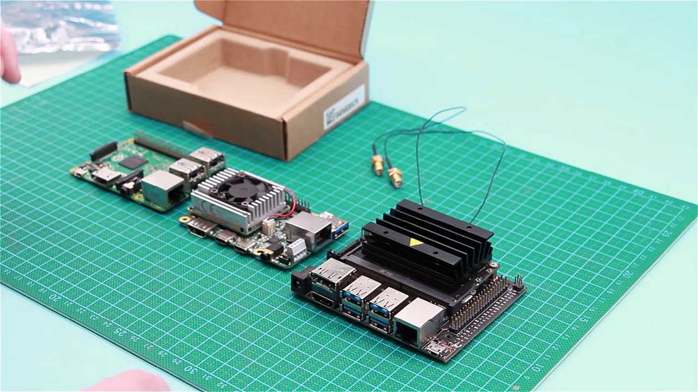
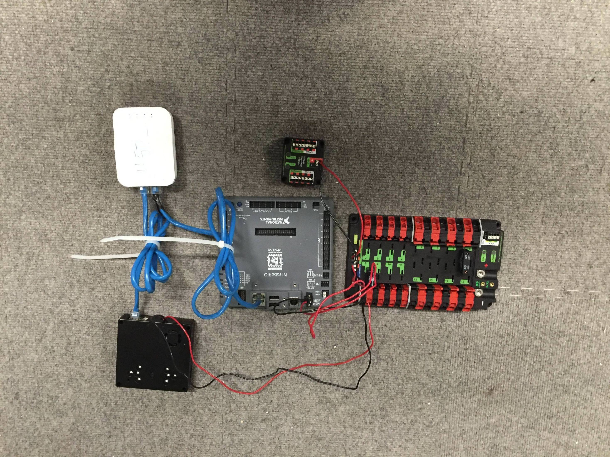
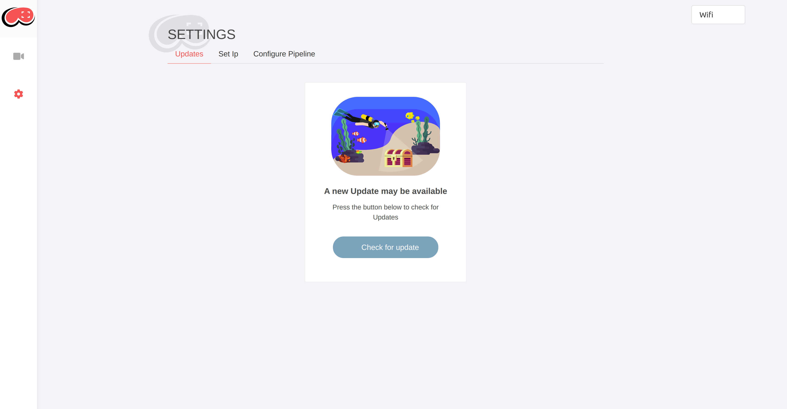

# **Getting Started**
This getting started guide will help you get your brand new **Reef** fully up and running.

## **Unboxing**
The first thing you want to do is take your brand new **Reef** out of its packaging and make sure you have all of the following. If not please contact us at contact@reef.vision.

## **Plugging It In**
Plug the USB-C side of the provided power supply into the **Reef**. The other end of the power supply needs to plug into your PDP with any breaker above 5A. You will also need to plug the supplied ethernet cable into the **Reef** and into your FRC radio.

## **Accessing the Reef**
Make sure you are connected to your robots network and then find the name of your **Reef** that we provided in the box. If you already threw it away go ahead and check your email. Use this name to access the **Reef** using *[Reef-Name].local:5801/*. You should now be able to access all the features of the **Reef** and should be able to see the camera already streaming.

## **Updating your Reef**
In order to update your **reef** you will first need to connect it to the internet. First navigate to the settings page while in your **reef**. From here click the wifi button in the top left corner and hit refresh then select your normal wifi (Not your robots network).

Then go ahead and disconnect the ethernet from the **Reef** and connect your computer to the same wifi the **Reef** is now connected to. You should now be able to check for an update and then follow the prompts to update your **Reef**. If you got disconnected in the process use the same URL again to get back into the **Reef** *[Reef-Name].local:5801/*.

## **Your All Set!**
Your own personal **Reef** is fully set up and has all the tools you need to start adding AI and low latency video to your FRC robot.

## **Whats Next?**
We have a few other guides that might be helpful

### **[Getting Started Without The FRC Control System](,/Local_Development/withoutfrc.md)**
### **[FRC Programming](./Programming/programming.md)**